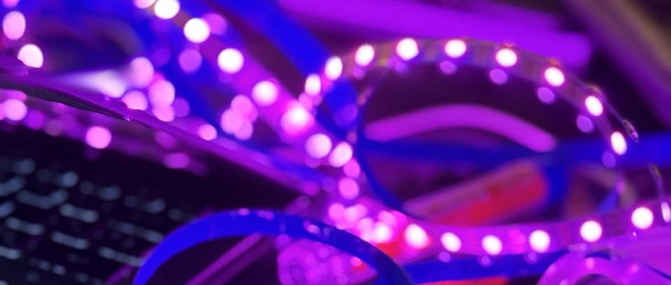

# Iluminación y Tecnología 25-2

En este curso pondremos en marcha soluciones tecnológicas para luminarias y en específico abordaremos programación de placas de desarrollo. Las prácticas que componen este curso también arrojarán ideas para la interacción y el diseño de estados.

En este repositorio podrán encontrar enlaces, códigos, esquemáticos e imágenes que estaremos abordando a lo largo del curso. 

## Sesiones 

- [ ] Sesión 01 - 27.01.25. [Introducción, sondeo e iteración actual](./s01/s01.md)
- [ ] Sesión 02 - 03.02.25. Día de asueto. 

## Enlaces

- https://www.arduino.cc/