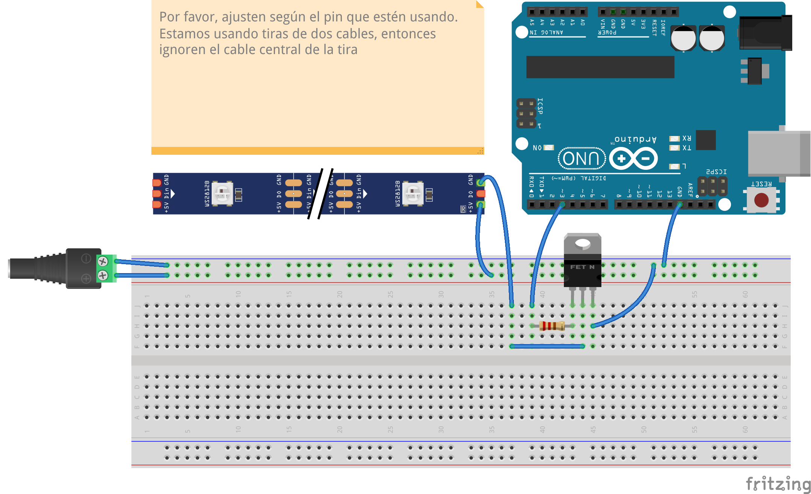
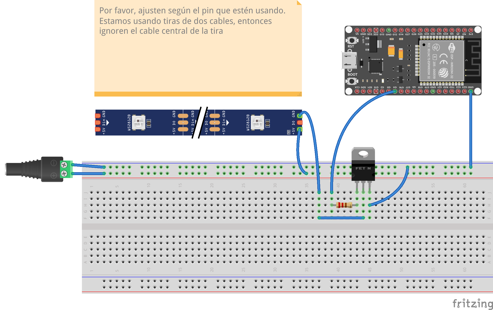
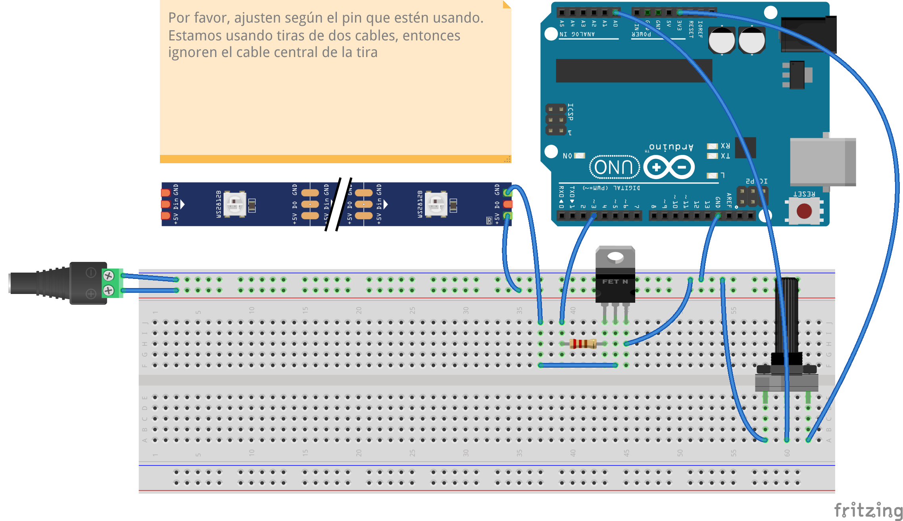
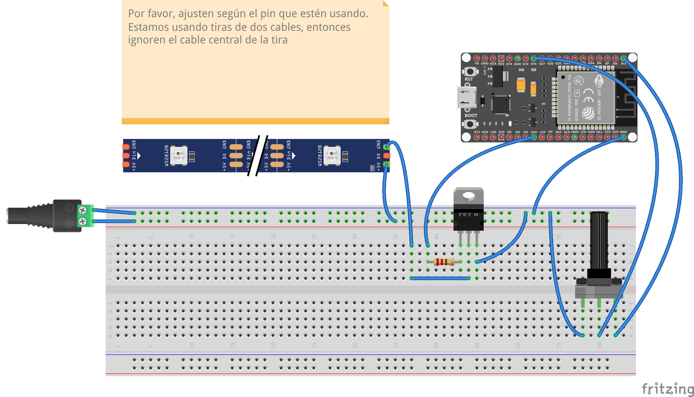

# Sesión 04. Transistores y tiras LED de 12V

En esta sesión vamos a poner en marcha un programa que permita controlar el encendido/apagado de tiras LED de 12V. 

Utilizaremos placas ESP32 / Arduinos. 

Tener en consideración: Alimentaremos la tiras con una fuente externa de 12V. 

## Avances

Dedicaremos la primera parte de la clase a revisar los avances y las ideas de los proyectos que pondrán en marcha. 

Con esto en consideración, podremos hacer ajustes según sea el caso. 

## Antes de empezar

Antes de empezar, vamos a repasar rápidamente cómo funciona una protoboard. 

## Transistores 

> Los transistores y relés son dispositivos de conmutación. Los interruptores normales se pueden accionar con el dedo, pero estos se pueden accionar mediante una señal electrónica procedente del microcontrolador. Piensen en ellos como pequeños interruptores que activan interruptores más grandes. Cuando aplica una pequeña cantidad de corriente a través del interruptor pequeño (la base en un transistor o la bobina en un relé), se activa el interruptor grande, lo que permite que fluya una gran cantidad de corriente a través de él. Los transistores son capaces de hacer mucho más que eso, pero empezarán por utilizarlos como interruptores electrónicos. Igoe, T. y O'Sullivan, D.

Pesando en la metáfora de los lfujos de agua, los transistores serán las llaves que nos permitirán activar/desactivar flujos. 

En esta ocasión vamos a usar [IRLZ44](https://www.alldatasheet.com/datasheet-pdf/view/441427/VISHAY/IRLZ44.html)

Es importante notar que tenemos tres patitas y un frente: 

- Gate (G): La pata izquierda.
- Drain (D): La pata del medio.
- Source (S): La pata derecha.

¿Por qué IRLZ44?

- Es compatible con los 12V de la tira LED.
- Puede manejar corrientes altas (hasta 47A).
- Tiene una resistencia en estado encendido muy baja, lo que lo hace eficiente.
- Es compatible con los 3.3V del ESP32.
- Es fácil de usar y económico.
- Es compatible con PWM para control de intensidad

## Reto #1

Conectar al menos una tira con un IRLZ44. 

Pueden usar el siguiente [código](./unaTira/unaTiraArduino.ino) de Arduino para activar el circuito. Deberán ajustar los pines de acuerdo a la placa que estén usando. 

Para Arduino: 

Para ESP32:

## Reto #2

Control de intensidad. Para controlar intensidad necesitan utilizar pines compatibles con PWM. Por [aquí](./intensidad/intensidad.ino) un código para cambiar intensidad. 

## Reto #3

Conectar dos pedazos de tira. Para este punto podrían estimar la longitud de las tiras y en general las características del proyecto. También podrían considerar la opción del cambio de intensidad. Pueden usar variaciones de los códigos anteriores. 

## Reto #4

Modulación de intensidad, velocidad o de ambas con potenciómetros. Tengan en cuenta que la alimentación del potenciómetro es distinta al de la tira LED pero en ambos casos comparten tierra.

A continuación las conexiones para Arduino

Y para ESP32

## Reto #5

Integrar el botón y el zumbador al circuito. 

## Para la siguiente clase

En la siguiente clase resolveremos los últimos detalles de sus proyectos. 